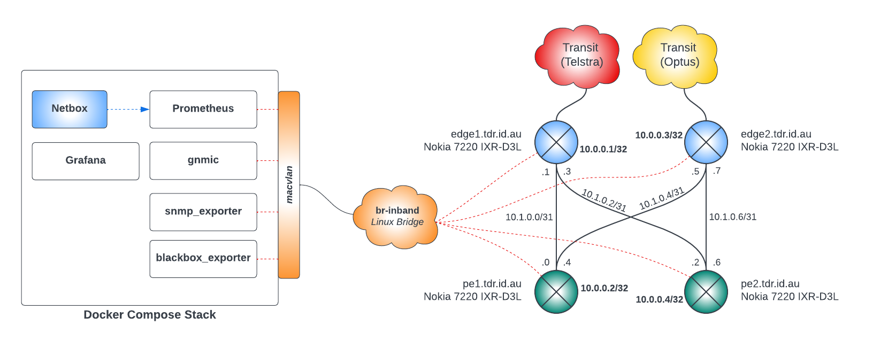
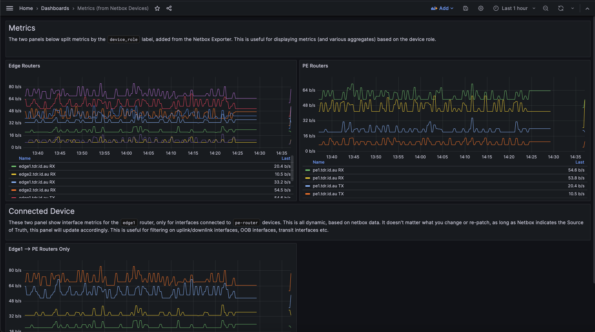

# ausnog-2023
Prometheus for Network Engineers - AusNOG Presentation

## Demo
This repo sets up the following:
- Containerlab network with 4x SR Linux nodes
- Production-read Netbox instance, pre-populated with sites, locations and racks.
- Prometheus instance, pre-configured with target discovery from netbox and a netbox-exporter.
- Grafana with pre-provisioned dashboards and data-sources.

## Quick start
- Install containerlab (https://containerlab.dev/install/)
- Perform host network setup (Debian/Ubuntu): `./net-setup.sh`
- Deploy the network `clab deploy`
  - Login to network devices, `ssh admin@clab-ausnog23-edge1` - keys should work, otherwise Password: `admin@123`
- Deploy the monitoring stack `docker compose up -d` - should take a bit for Netbox to be ready.
- Browse the various UIs
  - Prometheus: http://localhost:9090
  - Grafana: http://localhost:3000 Username: admin / Password: admin
  - Netbox: http://localhost:8000 Username: admin / Password: admin


## Containerlab Network

From the root of the repo, you can start the container lab network by following the containerlab installation guide then issuing `clab deploy`. You should result with a network running:
```
root@containerlab:/home/tim/ausnog-2023# clab inspect
INFO[0000] Parsing & checking topology file: ausnog.clab.yml
+---+---------------------+--------------+-----------------------+------+---------+----------------+----------------------+
| # |        Name         | Container ID |         Image         | Kind |  State  |  IPv4 Address  |     IPv6 Address     |
+---+---------------------+--------------+-----------------------+------+---------+----------------+----------------------+
| 1 | clab-ausnog23-edge1 | b289fe3c34dc | ghcr.io/nokia/srlinux | srl  | running | 172.20.20.2/24 | 2001:172:20:20::2/64 |
| 2 | clab-ausnog23-edge2 | 67e8f37dcc12 | ghcr.io/nokia/srlinux | srl  | running | 172.20.20.3/24 | 2001:172:20:20::3/64 |
| 3 | clab-ausnog23-pe1   | 3702bf8c4f95 | ghcr.io/nokia/srlinux | srl  | running | 172.20.20.5/24 | 2001:172:20:20::5/64 |
| 4 | clab-ausnog23-pe2   | d6803a6b2414 | ghcr.io/nokia/srlinux | srl  | running | 172.20.20.4/24 | 2001:172:20:20::4/64 |
+---+---------------------+--------------+-----------------------+------+---------+----------------+----------------------+
``` 

## Netbox
http://localhost:8000 - Username: admin / Password: admin

## Monitoring Components
### Prometheus
Access prometheus from `http://localhost:9090`, no login required. Configuration is in the prometheus directory along with recording rules. These recording rules perform `group_left()` queries to match streaming telemetry data with both netbox device data from the Netbox Exporter as well as interface information. You'll notice that the `interface_bitrate_rx:30s` metric also includes connected device labels about the other device, according to netbox.
### Blackbox Exporter
The blackbox exporter pings each network device as discovered from Netbox (device, state = Active). The API key is from the Netbox instance.

### Netbox Exporter
This is a custom-written exporter that queries the Netbox API for devices, interfaces and circuits and exposes the data as prometheus metrics. Examples below:
```
root@containerlab:/home/tim/ausnog-2023# curl localhost:9000/metrics
# HELP netbox_devices All netbox devices.
# TYPE netbox_devices gauge
netbox_devices{device="edge1.tdr.id.au",device_role="edge-router",device_type="nokia-7220-ixr-d3l-32-100ge",location="cage01",manufacturer="nokia",rack="R001",region="sydney",site="au-syd1"} 1.0
netbox_devices{device="edge2.tdr.id.au",device_role="edge-router",device_type="nokia-7220-ixr-d3l-32-100ge",location="cage01",manufacturer="nokia",rack="R001",region="sydney",site="au-syd1"} 1.0
netbox_devices{device="pe1.tdr.id.au",device_role="pe-router",device_type="nokia-7220-ixr-d3l-32-100ge",location="cage01",manufacturer="nokia",rack="R001",region="sydney",site="au-syd1"} 1.0
netbox_devices{device="pe2.tdr.id.au",device_role="pe-router",device_type="nokia-7220-ixr-d3l-32-100ge",location="cage01",manufacturer="nokia",rack="R001",region="sydney",site="au-syd1"} 1.0
# HELP netbox_interfaces All connected interfaces.
# TYPE netbox_interfaces gauge
netbox_interfaces{connected_device="pe1.tdr.id.au",connected_device_interface="ethernet-1/1",device="edge1.tdr.id.au",interface_name="ethernet-1/1"} 1.0
netbox_interfaces{connected_device="pe2.tdr.id.au",connected_device_interface="ethernet1-1",device="edge1.tdr.id.au",interface_name="ethernet-1/2"} 1.0
netbox_interfaces{connected_device="pe1.tdr.id.au",connected_device_interface="ethernet-1/2",device="edge2.tdr.id.au",interface_name="ethernet-1/1"} 1.0
netbox_interfaces{connected_device="pe2.tdr.id.au",connected_device_interface="ethernet1-2",device="edge2.tdr.id.au",interface_name="ethernet-1/2"} 1.0
netbox_interfaces{connected_device="edge1.tdr.id.au",connected_device_interface="ethernet-1/1",device="pe1.tdr.id.au",interface_name="ethernet-1/1"} 1.0
netbox_interfaces{connected_device="edge2.tdr.id.au",connected_device_interface="ethernet-1/1",device="pe1.tdr.id.au",interface_name="ethernet-1/2"} 1.0
netbox_interfaces{connected_device="edge1.tdr.id.au",connected_device_interface="ethernet-1/2",device="pe2.tdr.id.au",interface_name="ethernet1-1"} 1.0
netbox_interfaces{connected_device="edge2.tdr.id.au",connected_device_interface="ethernet-1/2",device="pe2.tdr.id.au",interface_name="ethernet1-2"} 1.0
# HELP netbox_interfaces All connected interfaces.
# TYPE netbox_interfaces gauge
netbox_interfaces{connected_circuit_id="TID-69420",connected_circuit_provider="telstra",connected_circuit_type="transit",device="edge1.tdr.id.au",interface_name="ethernet-1/4"} 1.0
netbox_interfaces{connected_circuit_id="OPT11456",connected_circuit_provider="optus",connected_circuit_type="transit",device="edge2.tdr.id.au",interface_name="ethernet-1/4"} 1.0
```

The recording rules then marry this data with the data collected by the `gnmic` container (streaming telemetry).

### gnmic
This container subscribes to the SR Linux telemetry path `/interface[name=ethernet-1/*]/statistics` for Nokia devices and the OpenConfig standard path of `/interfaces/interface[name=*]/state/counters` for Juniper devices (not included in this lab, due to image licenses). These metrics are scraped by Prometheus periodically.  More info about configuration can be found here: http://gnmic.openconfig.net

### SNMP Exporter
This has also been included in case the user wishes to play with it - e.g. adding non-Nokia, non-Streaming Telemetry images to the containerlab.

### Grafana
Grafana comes pre-configured with a dashboard and datasource for prometheus with a few panels that help indicate how metrics can be displayed based on the dynamic data from Netbox.
